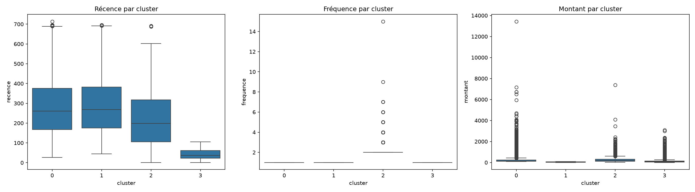

# Segmentation clients e-commerce par analyse RFM (dataset Olist : Kaggle)

## Contexte business

Une entreprise e-commerce veut identifier ses segments clients pour prioriser
ses actions marketing (rétention vs réactivation vs acquisition) et allouer
son budget marketing plus efficacement.

## Données

Dataset public Olist (e-commerce brésilien, ~93 000 clients uniques,
commandes livrées entre 2016-09-15 et 2018-08-30).

## Méthodologie

1. Nettoyage et fusion de 3 tables (commandes, articles, clients)
2. Calcul des indicateurs RFM (Récence, Fréquence, Montant) par client
3. Transformation logarithmique pour gérer les valeurs extrêmes
4. Clustering K-Means (k=4, déterminé par méthode du coude)

## Résultats : 4 segments identifiés

| Cluster |         Nom proposé        |                                  Profil                                  |                                            Recommandation   business                                            |
|:-------:|:--------------------------:|:------------------------------------------------------------------------:|:---------------------------------------------------------------------------------------------------------------:|
|    3    | Nouveaux   clients récents | Achat   il y a 42j en moyenne, 1 commande, panier moyen 117 R$           | Cibler   avec du email/retargeting pour transformer en clients récurrents avant qu'ils   ne deviennent dormants |
|    2    | Clients   fidèles / VIP    | Peu   nombreux (2801, ~3%) mais fréquence 2.1 et montant 260 R$          | Priorité   rétention : programme de fidélité, offres exclusives ce sont tes meilleurs   clients                 |
|    0    | Dormants   à forte valeur  | Inactifs   depuis 278j, mais montant élevé (237 R$) quand ils achetaient | Cible   idéale pour une campagne de réactivation, fort potentiel de retour sur   investissement marketing       |
|    1    | Dormants   à faible valeur | Inactifs   depuis 284j, faible montant (45 R$)                           | Faible   priorité marketing, ou campagne à très bas coût seulement                                              |

## Recommandation business clé

74% des clients sont inactifs depuis plus de 9 mois. Une campagne de
réactivation ciblée sur le segment "Dormants à forte valeur" (cluster 0)
représente le meilleur retour sur investissement marketing potentiel.

## Visualisations

## Stack technique

Python, Pandas, Scikit-learn, Matplotlib, Seaborn

## Pour aller plus loin

- Automatiser ce scoring en pipeline mensuel
- A/B tester une campagne de réactivation sur le cluster 0
